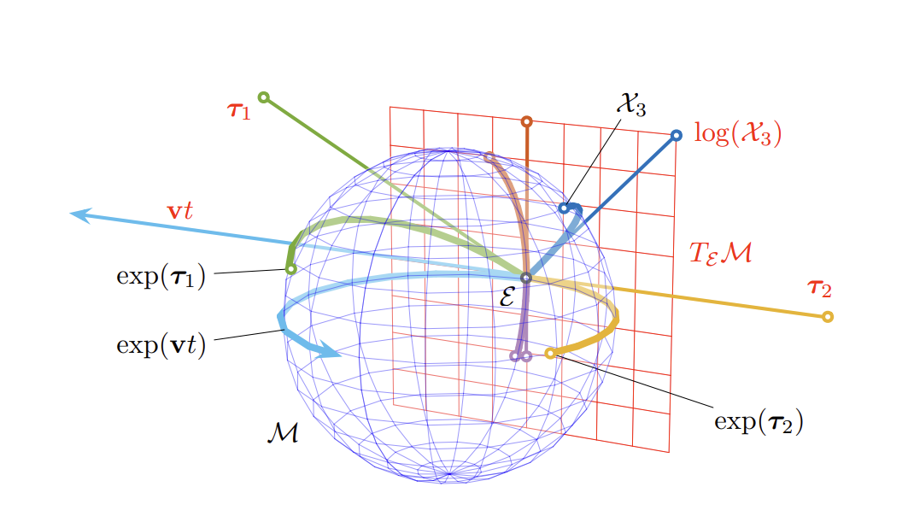
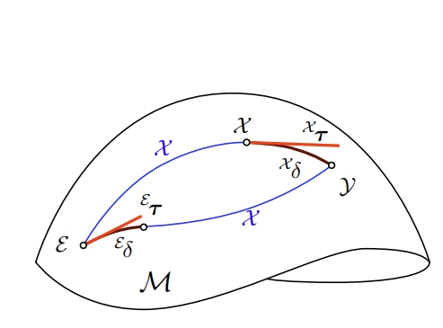

# A micro Lie theory for state estimation in robotic

Paper link: [https://arxiv.org/pdf/1812.01537](https://arxiv.org/pdf/1812.01537)

---

Intro about what we are trying to do with this:

- Perturb on manifold
- Uncertainty in manifolds, covariance propagation
- 

## What is Lie Group.

Elements of the lie groups follow the following conditions:

### 1. It is a group

This operation must satisfy the **group axioms**:

1. **Closure:**

$$
\forall \mathcal{X}, \mathcal{Y} \in \mathbb{G},\quad \mathcal{X} \circ \mathcal{Y} \in \mathbb{G}
$$

1. **Identity element**

$$
\exists \mathcal{E} \in \mathbb{G} \text{ such that }
\mathcal{X} \circ \mathcal{E} = \mathcal{E} \circ \mathcal{X} = \mathcal{X}
$$

1. **Inverse element**

$$
\forall \mathcal{X} \in \mathbb{G},\quad \exists \mathcal{X}^{-1} \in \mathbb{G} \text{ such that } 
\mathcal{X} \circ \mathcal{X}^{-1} = \mathcal{E}
$$

1. **Associativity**

$$
(\mathcal{X} \circ \mathcal{Y}) \circ \mathcal{Z} = \mathcal{X} \circ (\mathcal{Y} \circ \mathcal{Z})
$$

### 2. It is a smooth manifold.

1. $\mathbb{G}$ locally looks like $\mathbb{R}^n$, and the overlaps between local coordinate systems are smooth.

### **3. The group operations are smooth maps:**

If you slightly perturb group element $\mathcal{X}$ or $\mathcal{Y}$, then the composed result of $\mathcal{X} \circ \mathcal{Y}$ changes smoothly, without jumps, discontinuities, corners, or undefined derivatives.

$$
\mu: \mathbb{G} \times \mathbb{G} \to \mathbb{G}, \quad \mu(\mathcal{X}, \mathcal{Y}) = \mathcal{X} \circ \mathcal{Y} \quad \text{(multiplication is smooth)}
$$

$$
\iota: \mathbb{G} \to \mathbb{G}, \quad \iota(\mathcal{X}) = \mathcal{X}^{-1} \quad \text{(inversion is smooth)}
$$

## Examples of Lie Manifolds

| **Name** | **1. Is a Group?** | **2. Is a Smooth Manifold?** | **3. Operations Compatible?** | **Plain English Intuition** |
| --- | --- | --- | --- | --- |
| **ℝⁿ** | ✅ Addition works, has identity (0),  | ✅ Already flat — it IS ℝⁿ | ✅ Addition and subtraction are smooth | *The simplest example. A flat infinite space.* |
| **S¹ (Unit Complex Numbers)** | ✅ Multiplication of complex numbers of norm 1 | ✅ A circle — zoom in and it looks like a line (ℝ¹) | ✅ Multiplication and inversion are smooth | *Think of angles on a clock. Adding angles is the group operation.* |
| **S³ (Unit Quaternions)** | ✅ Quaternion multiplication | ✅ Level set of f=1 in ℝ⁴, gradient never zero there | ✅ Quaternion multiply/invert are smooth | *4D generalization of the circle. Used in 3D rotations.* |
| **GL(n, ℝ) (Invertible Matrices)** | ✅ Matrix multiplication, identity is I, inverses exist | ✅ Open subset of ℝⁿ² (where det ≠ 0), so it's flat | ✅ Matrix multiply and invert are smooth | *All invertible n×n matrices. Open subset of flat space.* |
| **SO(3) (3D Rotations)** | ✅ Composing rotations, identity is 'do nothing' | ✅ Closed subgroup of GL(3,ℝ), inherits smooth structure | ✅ Composing and inverting rotations are smooth | *Every rotation of a ball. Zoom in and it looks like ℝ³.* |
| **SL(n, ℝ) (det = 1 Matrices)** | ✅ Matrix multiplication preserves det = 1 | ✅ Level set of det = 1, gradient never zero there | ✅ Operations are smooth | *Matrices that preserve volume. Built via level set theorem.* |

## Examples of Non Lie Manifolds

| **Name** | **1. Is a Group?** | **2. Is a Smooth Manifold?** | **3. Operations Compatible?** | **Plain English Intuition** |
| --- | --- | --- | --- | --- |
| **ℤ (Integers)** | ✅ Addition works fine | ❌ Discrete points — cannot zoom in and see ℝⁿ | N/A | *Just isolated dots on a number line. No smoothness possible.* |
| **S² (2-Sphere)** | ❌ No smooth group operation exists on S² | ✅ Is a smooth manifold (surface of a ball) | ❌ Fails — can't define smooth group structure | *A smooth manifold but NOT a Lie group. Being a manifold isn't enough!* |

---

# Group Action

## What is it and why should we care?

Given a Lie group $\mathbb{M}$ and a space $\mathbb{V}$ on which $\mathbb{M}$ acts, the action of a group element $\mathcal{X} \in \mathbb{M}$ on an element $v \in \mathbb{V}$ is written $\mathcal{X} \cdot v$, and is a map:

$$
\cdot : \mathbb{M} \times \mathbb{V} \to \mathbb{V} ; (\mathcal{X}, v) \mapsto \mathcal{X} \cdot v
$$

For this to be a valid group action, it must satisfy two axioms:

**Identity:** $\mathcal{E} \cdot v = v$ (the identity element leaves $v$ unchanged)

**Compatibility:** $(\mathcal{X} \circ Y) \cdot v = X \cdot (Y \cdot v)$ (composing two group elements first, then acting, is the same as acting one after the other)

### Common examples in robotics

| Group | Space acted on $\mathbb{V}$ | Action |
| --- | --- | --- |
| $SO(n)$ — rotation matrices | $x \in \mathbb{R}^n$ | $R \cdot x \triangleq Rx$ |
| $SE(n)$ — rigid motion | $x \in \mathbb{R}^n$ | $H \cdot x \triangleq Rx + t$ |
| $S^1$ — unit complex numbers | $x \in \mathbb{C} \cong \mathbb{R}^2$ | $z \cdot x \triangleq zx$ |
| $S^3$ — unit quaternions | $x \in \mathbb{H}_p \cong \mathbb{R}^3$ pure imaginary quaternions | $q \cdot x \triangleq q \cdot x \cdot q^*$ |

---

# Tangent Spaces

A Lie group is not only a group, but also a smooth manifold. Because it is smooth, every point on the manifold has a well-defined tangent space.

**🧭 Tangent space idea**

Suppose a group element $\mathcal{X(t)}$ moves on the Lie group manifold ($\mathbb{M}$). Its velocity is

$$
\dot{\mathcal{X}} = \frac{\partial \mathcal{X}}{\partial t}
$$

This velocity does not live directly on the manifold. Instead, it belongs to the tangent space at the current point $\mathcal{X(t)}$ written as

$$
T_X\mathcal{M}
$$

The tangent space can be thought of as the local linear approximation of the manifold around (X). Since the manifold is smooth, there are no sharp corners, edges, or spikes, so each point has a unique tangent space.

Notes:

1. Explain what is geodesic based on the above picture.

## What do tangent spaces look like?

[Tangent Space - Complex Numbers](notes/tangent-space-complex-numbers.md)

[Tangent Space - Quaternions](notes/tangent-space-quaternions.md)

[Tangent Space - SO3](notes/tangent-space-so3.md)

| Lie group M, ◦ | size | dim | X ∈ M | Constraint | τ∧ ∈ m | τ ∈ Rᵐ | Exp(τ) | Comp. | Action |
| --- | --- | --- | --- | --- | --- | --- | --- | --- | --- |
| n-D vector Rⁿ, + | n | n | v ∈ Rⁿ | v − v = 0 | v ∈ Rⁿ | v ∈ Rⁿ | v = exp(v) | v₁+v₂ | v + x |
| Circle S¹, · | 2 | 1 | z ∈ ℂ | z*z = 1 | iθ ∈ iR | θ ∈ R | z = exp(iθ) | z₁z₂ | z x |
| Rotation SO(2), · | 4 | 1 | R | R⊤R = I | [θ]× ∈ so(2) | θ ∈ R | R = exp([θ]×) | R₁R₂ | R x |
| Rigid motion SE(2), · | 9 | 3 | M = [R t; 0 1] | R⊤R = I | [[θ]× ρ; 0 0] ∈ se(2) | (ρ θ) ∈ R³ | exp([[θ]× ρ; 0 0]) | M₁M₂ | Rx+t |
| 3-sphere S³, · | 4 | 3 | q ∈ ℍ | q*q = 1 | θ/2 ∈ Hₚ | θ ∈ R³ | q = exp(uθ/2) | q₁q₂ | q x q* |
| Rotation SO(3), · | 9 | 3 | R | R⊤R = I | [θ]× ∈ so(3) | θ ∈ R³ | R = exp([θ]×) | R₁R₂ | R x |
| Rigid motion SE(3), · | 16 | 6 | M = [R t; 0 1] | R⊤R = I | [[θ]× ρ; 0 0] ∈ se(3) | (ρ θ) ∈ R⁶ | exp([[θ]× ρ; 0 0]) | M₁M₂ | Rx+t |

---

# Lie Algebra

The special tangent space at the identity element (E) is called the Lie algebra:

$$
\mathfrak{m} \triangleq T_E\mathcal{M}
$$

Every Lie group has an associated Lie algebra. The Lie algebra is important because it is a vector space, which means we can use normal linear algebra there. Its elements can be represented as vectors in $\mathbb{R}^m$, where (m) is the number of degrees of freedom of the Lie group.

Example:

$$
SO(3) \leftrightarrow \mathfrak{so}(3)
$$

$$
SE(3) \leftrightarrow \mathfrak{se}(3)
$$

Questions to ask:

Can any group element like $\mathcal{X_3}$ on the manifold be represented using lie algebra?

## exp and log maps

The Lie group and Lie algebra are connected through the exponential and logarithm maps:

$$
\operatorname{Exp}: \mathfrak{m} \rightarrow \mathcal{M}
$$

$$
\operatorname{Log}: \mathcal{M} \rightarrow \mathfrak{m}
$$

The exponential map takes a small vector-like perturbation from the Lie algebra and maps it onto the manifold. The logarithm map does the reverse.

**This is extremely useful in robotics because optimization and filtering usually happen in vector spaces, while states such as rotations and poses live on curved manifolds.**

---

# The Cartesian vector space

## Hat and Vee Operators

## Exp and Log Operators

---

# Plus and minus operators

<aside>
➕

Note: The left and right operators do not do the same thing

</aside>

### Right operators

| **Question** | **Answer** |
| --- | --- |
| **X ⊕ Xτ = ?** | A: Y |
| **X ◦ Exp(Xτ) = ?** | Y |
| **Y ⊖ X = ?** | A: Xτ |
| **Log(X⁻¹ ◦ Y) = ?** | A: Xτ |

---

### Left operators

| **Question** | **Answer** |
| --- | --- |
| **Q:** **`Eτ ⊕ X = ?`** | A: `Y` |
| **Q:** **`Exp(Eτ) ◦ X = ?`** | A: `Y` |
| **Q:** **`Y ⊖ X = ?`** | A: `Eτ` |
| **Q:** **`Log(Y ◦ X⁻¹) = ?`** | A: `Eτ` |

# Adjoint

Properties and its derivation

# Derivatives on Lie groups

 Right Jacobians on Lie goups

 Left Jacobians on Lie goups

# Uncertainty in manifolds, covariance propagation

Consider a rotations $[\theta_x, \theta_y, \theta_z]$ and we perturb this by $[\delta\theta_x, \delta\theta_y, \delta\theta_z]$, so the covariance will be:

$$

\Sigma_\theta
=
\begin{bmatrix}
\delta\theta_x^2 & 0 & 0 \\
0 & \delta\theta_y^2 & 0 \\
0 & 0 & \delta\theta_z^2 \\
\end{bmatrix}
$$

# Rules for Differentiation
