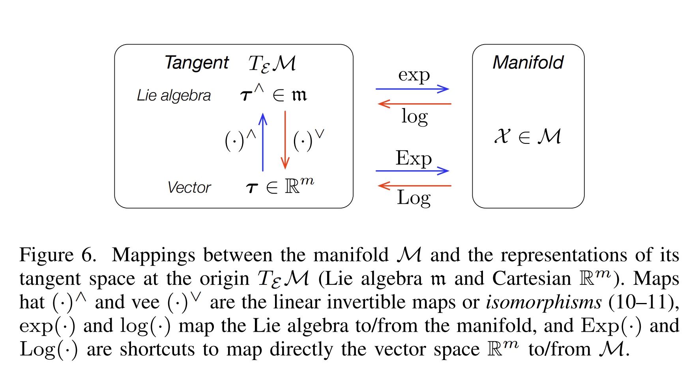

# A micro Lie theory for state estimation in robotic

Paper link: [https://arxiv.org/pdf/1812.01537](https://arxiv.org/pdf/1812.01537)

[Nomenclature](notes/nomenclature.md)

---

Intro about what we are trying to do with this:

- Perturb on manifold
- Uncertainty in manifolds, covariance propagation
- 

## What is Lie Group.

Elements of the lie groups follow the following conditions:

### 1. It is a group

This operation must satisfy the **group axioms**:

1. **Closure:**

$$
\forall \mathcal{X}, \mathcal{Y} \in \mathbb{G},\quad \mathcal{X} \circ \mathcal{Y} \in \mathbb{G}
$$

1. **Identity element**

$$
\exists \mathcal{E} \in \mathbb{G} \text{ such that }
\mathcal{X} \circ \mathcal{E} = \mathcal{E} \circ \mathcal{X} = \mathcal{X}
$$

1. **Inverse element**

$$
\forall \mathcal{X} \in \mathbb{G},\quad \exists \mathcal{X}^{-1} \in \mathbb{G} \text{ such that } 
\mathcal{X} \circ \mathcal{X}^{-1} = \mathcal{E}
$$

1. **Associativity**

$$
(\mathcal{X} \circ \mathcal{Y}) \circ \mathcal{Z} = \mathcal{X} \circ (\mathcal{Y} \circ \mathcal{Z})
$$

### 2. It is a smooth manifold.

1. $\mathbb{G}$ locally looks like $\mathbb{R}^n$, and the overlaps between local coordinate systems are smooth.

### **3. The group operations are smooth maps:**

If you slightly perturb group element $\mathcal{X}$ or $\mathcal{Y}$, then the composed result of $\mathcal{X} \circ \mathcal{Y}$ changes smoothly, without jumps, discontinuities, corners, or undefined derivatives.

$$
\mu: \mathbb{G} \times \mathbb{G} \to \mathbb{G}, \quad \mu(\mathcal{X}, \mathcal{Y}) = \mathcal{X} \circ \mathcal{Y} \quad \text{(multiplication is smooth)}
$$

$$
\iota: \mathbb{G} \to \mathbb{G}, \quad \iota(\mathcal{X}) = \mathcal{X}^{-1} \quad \text{(inversion is smooth)}
$$

## Examples of Lie Manifolds

| **Name** | **1. Is a Group?** | **2. Is a Smooth Manifold?** | **3. Operations Compatible?** | **Plain English Intuition** |
| --- | --- | --- | --- | --- |
| **ℝⁿ** | ✅ Addition works, has identity (0),  | ✅ Already flat — it IS ℝⁿ | ✅ Addition and subtraction are smooth | *The simplest example. A flat infinite space.* |
| **S¹ (Unit Complex Numbers)** | ✅ Multiplication of complex numbers of norm 1 | ✅ A circle — zoom in and it looks like a line (ℝ¹) | ✅ Multiplication and inversion are smooth | *Think of angles on a clock. Adding angles is the group operation.* |
| **S³ (Unit Quaternions)** | ✅ Quaternion multiplication | ✅ Level set of f=1 in ℝ⁴, gradient never zero there | ✅ Quaternion multiply/invert are smooth | *4D generalization of the circle. Used in 3D rotations.* |
| **GL(n, ℝ) (Invertible Matrices)** | ✅ Matrix multiplication, identity is I, inverses exist | ✅ Open subset of ℝⁿ² (where det ≠ 0), so it's flat | ✅ Matrix multiply and invert are smooth | *All invertible n×n matrices. Open subset of flat space.* |
| **SO(3) (3D Rotations)** | ✅ Composing rotations, identity is 'do nothing' | ✅ Closed subgroup of GL(3,ℝ), inherits smooth structure | ✅ Composing and inverting rotations are smooth | *Every rotation of a ball. Zoom in and it looks like ℝ³.* |
| **SL(n, ℝ) (det = 1 Matrices)** | ✅ Matrix multiplication preserves det = 1 | ✅ Level set of det = 1, gradient never zero there | ✅ Operations are smooth | *Matrices that preserve volume. Built via level set theorem.* |

## Examples of Non Lie Manifolds

| **Name** | **1. Is a Group?** | **2. Is a Smooth Manifold?** | **3. Operations Compatible?** | **Plain English Intuition** |
| --- | --- | --- | --- | --- |
| **ℤ (Integers)** | ✅ Addition works fine | ❌ Discrete points — cannot zoom in and see ℝⁿ | N/A | *Just isolated dots on a number line. No smoothness possible.* |
| **S² (2-Sphere)** | ❌ No smooth group operation exists on S² | ✅ Is a smooth manifold (surface of a ball) | ❌ Fails — can't define smooth group structure | *A smooth manifold but NOT a Lie group. Being a manifold isn't enough!* |

---

# Group Action

## What is it and why should we care?

Given a Lie group $\mathbb{M}$ and a space $\mathbb{V}$ on which $\mathbb{M}$ acts, the action of a group element $\mathcal{X} \in \mathbb{M}$ on an element $v \in \mathbb{V}$ is written $\mathcal{X} \cdot v$, and is a map:

$$
\cdot : \mathbb{M} \times \mathbb{V} \to \mathbb{V} ; (\mathcal{X}, v) \mapsto \mathcal{X} \cdot v
$$

For this to be a valid group action, it must satisfy two axioms:

**Identity:** $\mathcal{E} \cdot v = v$ (the identity element leaves $v$ unchanged)

**Compatibility:** $(\mathcal{X} \circ Y) \cdot v = X \cdot (Y \cdot v)$ (composing two group elements first, then acting, is the same as acting one after the other)

### Common examples in robotics

| Group | Space acted on $\mathbb{V}$ | Action |
| --- | --- | --- |
| $SO(n)$ — rotation matrices | $x \in \mathbb{R}^n$ | $R \cdot x \triangleq Rx$ |
| $SE(n)$ — rigid motion | $x \in \mathbb{R}^n$ | $H \cdot x \triangleq Rx + t$ |
| $S^1$ — unit complex numbers | $x \in \mathbb{C} \cong \mathbb{R}^2$ | $z \cdot x \triangleq zx$ |
| $S^3$ — unit quaternions | $x \in \mathbb{H}_p \cong \mathbb{R}^3$ pure imaginary quaternions | $q \cdot x \triangleq q \cdot x \cdot q^*$ |

---

# Tangent Spaces

A Lie group is not only a group, but also a smooth manifold. Because it is smooth, every point on the manifold has a well-defined tangent space.

**🧭 Tangent space idea**

Suppose a group element $\mathcal{X(t)}$ moves on the Lie group manifold ($\mathbb{M}$). Its velocity is

$$
\dot{\mathcal{X}} = \frac{\partial \mathcal{X}}{\partial t}
$$

This velocity does not live directly on the manifold. Instead, it belongs to the tangent space at the current point $\mathcal{X(t)}$ written as

$$
T_X\mathcal{M}
$$

The tangent space can be thought of as the local linear approximation of the manifold around (X). Since the manifold is smooth, there are no sharp corners, edges, or spikes, so each point has a unique tangent space.

Notes:

1. Explain what is geodesic based on the above picture.

## What do tangent spaces look like?

[Tangent Space - Complex Numbers](notes/tangent-space-complex-numbers.md)

[Tangent Space - Quaternions](notes/tangent-space-quaternions.md)

[Tangent Space - SO3](notes/tangent-space-so3.md)

| Lie group $\mathbb{M}, \circ$ | size | dim | Element $\mathcal{X} \in \mathbb{M}$ | Constraint | Tangent element $\epsilon \in \mathfrak{m}$ | Coordinate $\tau \in \mathbb{R}^m$ | $\operatorname{Exp}(\tau)$ | Composition | Action |
| --- | --- | --- | --- | --- | --- | --- | --- | --- | --- |
| $n$-D vector space $\mathbb{R}^n, +$ | $n$ | $n$ | $v \in \mathbb{R}^n$ | none | $\epsilon \in \mathbb{R}^n$ | $\tau \in \mathbb{R}^n$ | $\operatorname{Exp}(\tau) = \tau$ | $v_1 + v_2$ | $v + x$ |
| Circle $S^1, \cdot$ | $2$ | $1$ | $z \in \mathbb{C}$ | $z^*z = 1$ | $i\theta \in i\mathbb{R}$ | $\theta \in \mathbb{R}$ | $\operatorname{Exp}(\theta) = \exp(i\theta)$ | $z_1z_2$ | $zx$ |
| Rotation $SO(2), \cdot$ | $4$ | $1$ | $R \in \mathbb{R}^{2 \times 2}$ | $R^\top R = I$ | $\epsilon \in \mathfrak{so}(2)$ | $\theta \in \mathbb{R}$ | $\operatorname{Exp}(\theta) = \exp(\epsilon)$ | $R_1R_2$ | $Rx$ |
| Rigid motion $SE(2), \cdot$ | $9$ | $3$ | $H = \begin{bmatrix}R & t \\ 0 & 1\end{bmatrix}$ | $R^\top R = I$ | $\epsilon \in \mathfrak{se}(2)$ | $\tau \in \mathbb{R}^3$ | $\operatorname{Exp}(\tau) = \exp(\epsilon)$ | $H_1H_2$ | $Rx + t$ |
| Unit quaternions $\mathbb{H}_1, \cdot$ | $4$ | $3$ | $q \in \mathbb{H}$ | $q^*q = 1$ | $\begin{bmatrix}0 \\ \phi\end{bmatrix} \in \mathfrak{h}_1$ | $\phi \in \mathbb{R}^3$ | $\operatorname{Exp}(\phi) = \exp\left(\begin{bmatrix}0 \\ \phi\end{bmatrix}\right)$ | $q_1q_2$ | $qxq^*$ |
| Rotation $SO(3), \cdot$ | $9$ | $3$ | $R \in \mathbb{R}^{3 \times 3}$ | $R^\top R = I$ | $\epsilon \in \mathfrak{so}(3)$ | $\theta \in \mathbb{R}^3$ | $\operatorname{Exp}(\theta) = \exp(\epsilon)$ | $R_1R_2$ | $Rx$ |
| Rigid motion $SE(3), \cdot$ | $16$ | $6$ | $H = \begin{bmatrix}R & t \\ 0 & 1\end{bmatrix}$ | $R^\top R = I$ | $\epsilon \in \mathfrak{se}(3)$ | $\tau \in \mathbb{R}^6$ | $\operatorname{Exp}(\tau) = \exp(\epsilon)$ | $H_1H_2$ | $Rx + t$ |

---

# Lie Algebra

The special tangent space at the identity element (E) is called the Lie algebra:

$$
\mathfrak{m} \triangleq T_E\mathcal{M}
$$

Every Lie group has an associated Lie algebra. The Lie algebra is important because it is a vector space, which means we can use normal linear algebra there. Its elements can be represented as vectors in $\mathbb{R}^m$, where (m) is the number of degrees of freedom of the Lie group.

Example:

$$
SO(3) \leftrightarrow \mathfrak{so}(3)
$$

$$
SE(3) \leftrightarrow \mathfrak{se}(3)
$$

Questions to ask:

Can any group element like $\mathcal{X_3}$ on the manifold be represented using lie algebra?

## exp and log maps

The Lie group and Lie algebra are connected through the exponential and logarithm maps:

$$
\operatorname{Exp}: \mathfrak{m} \rightarrow \mathcal{M}
$$

$$
\operatorname{Log}: \mathcal{M} \rightarrow \mathfrak{m}
$$

The exponential map takes a small vector-like perturbation from the Lie algebra and maps it onto the manifold. The logarithm map does the reverse.

**This is extremely useful in robotics because optimization and filtering usually happen in vector spaces, while states such as rotations and poses live on curved manifolds.**

---

# The Cartesian vector space

Lie algebra elements are the "local motion" objects for a Lie group. The only catch is that they do not always look like simple vectors:

- For $S^1$, the Lie algebra element looks like an imaginary number: $i\theta$.
- For $SO(3)$, the Lie algebra element is a skew-symmetric matrix.
- For unit quaternions, the Lie algebra element is a pure imaginary quaternion.
- For $SE(3)$, the Lie algebra element is a matrix mixing rotation and translation.

These are useful mathematically, but annoying to carry around in code and in derivations. For example, an $SO(3)$ tangent vector can be represented as the skew-symmetric matrix

$$
\theta^\wedge =
\begin{bmatrix}
0 & -\theta_z & \theta_y \\
\theta_z & 0 & -\theta_x \\
-\theta_y & \theta_x & 0
\end{bmatrix}
\in \mathfrak{so}(3)
$$

but it is much easier to store and manipulate the three numbers

$$
\theta =
\begin{bmatrix}
\theta_x & \theta_y & \theta_z
\end{bmatrix}^\top
\in \mathbb{R}^3
$$

So the pattern is:

$$
\text{structured Lie algebra object} \leftrightarrow \text{plain coordinate vector}
$$

## Hat and Vee Operators

The **hat** operator is the thing that turns the easy vector representation into the structured Lie algebra representation.

$$
(\cdot)^\wedge : \mathbb{R}^m \rightarrow \mathfrak{m}
$$

For example, in $SO(3)$ we usually keep the rotation perturbation as a normal vector $\theta \in \mathbb{R}^3$. When we need the skew-symmetric matrix, we apply hat:

$$
\theta \mapsto \theta^\wedge \in \mathfrak{so}(3)
$$

The **vee** operator does the reverse. It takes the structured Lie algebra object and pulls out the plain vector:

$$
(\cdot)^\vee : \mathfrak{m} \rightarrow \mathbb{R}^m
$$

$$
\tau^\wedge \mapsto (\tau^\wedge)^\vee = \tau
$$

They are inverse operations:

$$
(\tau^\wedge)^\vee = \tau
$$

$$
\left((\tau^\wedge)^\vee\right)^\wedge = \tau^\wedge
$$

Example intuition:

| Coordinate vector | Lie algebra element |
| --- | --- |
| $\theta \in \mathbb{R}$ | $i\theta$ for $S^1$ |
| $\phi \in \mathbb{R}^3$ | $\phi^\wedge \in \mathfrak{so}(3)$ |
| $\tau \in \mathbb{R}^6$ | $\tau^\wedge \in \mathfrak{se}(3)$ |

So mentally:

$$
\text{vector} \xrightarrow{\text{hat}} \text{Lie algebra object}
$$

$$
\text{Lie algebra object} \xrightarrow{\text{vee}} \text{vector}
$$

## Exp and Log Operators

There are two closely related versions of exp/log:

1. Lowercase $\exp$ and $\log$ act on the structured Lie algebra $\mathfrak{m}$.
2. Uppercase $\operatorname{Exp}$ and $\operatorname{Log}$ act on the coordinate vector space $\mathbb{R}^m$.

Using hat and vee, the coordinate-space maps are:

$$
\operatorname{Exp}(\tau) \triangleq \exp(\tau^\wedge)
$$

$$
\operatorname{Log}(\mathcal{X}) \triangleq \left(\log(\mathcal{X})\right)^\vee
$$

So in this repo, when we write a perturbation like $\tau$, we usually mean the vector-coordinate form in $\mathbb{R}^m$. The structured Lie algebra element $\tau^\wedge$ is used only when needed to apply the matrix/complex/quaternion exponential.

## Closed Forms of the Exponential

For multiplicative groups, the exponential map is built from the usual Taylor series:

$$
\exp(\tau^\wedge)
=
\mathcal{E}
+ \tau^\wedge
+ \frac{1}{2!}(\tau^\wedge)^2
+ \frac{1}{3!}(\tau^\wedge)^3
+ \cdots
$$

Here $\mathcal{E}$ is the identity element of the group. For matrix groups, this is just the identity matrix.

The nice part is that many Lie algebras have special algebraic structure, so this infinite series can often be simplified into a closed-form formula. For example:

- For $SO(3)$, powers of $\theta^\wedge$ lead to Rodrigues' rotation formula.
- For unit quaternions, powers of a pure imaginary quaternion lead to the familiar $\cos$ and $\sin$ formula.

The logarithm map is then found by inverting the exponential map.

Some useful exponential identities:

$$
\exp((t+s)\tau^\wedge)
=
\exp(t\tau^\wedge)\exp(s\tau^\wedge)
$$

$$
\exp(t\tau^\wedge)
=
\exp(\tau^\wedge)^t
$$

$$
\exp(-\tau^\wedge)
=
\exp(\tau^\wedge)^{-1}
$$

$$
\exp(\mathcal{X}\tau^\wedge\mathcal{X}^{-1})
=
\mathcal{X}\exp(\tau^\wedge)\mathcal{X}^{-1}
$$

The last identity is especially useful: conjugating inside the exponential is the same as conjugating the final group element. You can see why by expanding the Taylor series; the middle $\mathcal{X}^{-1}\mathcal{X}$ terms cancel out in every power.

---

# Plus and minus operators

Note: The left and right operators do not do the same thing

We use the same generic notation from [Nomenclature](notes/nomenclature.md):

- $\mathcal{X}, \mathcal{Y}$ are manifold/group elements.
- $\tau \in \mathbb{R}^m$ is a vector-space coordinate.
- ${}^{\mathcal{X}}\tau$ means the perturbation is applied on the right of $\mathcal{X}$.
- ${}^{\mathcal{E}}\tau$ means the perturbation is applied from the identity side.

### Right operators

$\mathcal{X} \oplus {}^{\mathcal{X}}\tau = ?$

$$
\mathcal{Y}
$$

$\mathcal{X} \circ \operatorname{Exp}({}^{\mathcal{X}}\tau) = ?$

$$
\mathcal{Y}
$$

$\mathcal{Y} \ominus \mathcal{X} = ?$

$$
{}^{\mathcal{X}}\tau
$$

$\operatorname{Log}(\mathcal{X}^{-1} \circ \mathcal{Y}) = ?$

$$
{}^{\mathcal{X}}\tau
$$

---

### Left operators

${}^{\mathcal{E}}\tau \oplus \mathcal{X} = ?$

$$
\mathcal{Y}
$$

$\operatorname{Exp}({}^{\mathcal{E}}\tau) \circ \mathcal{X} = ?$

$$
\mathcal{Y}
$$

$\mathcal{Y} \ominus \mathcal{X} = ?$

$$
{}^{\mathcal{E}}\tau
$$

$\operatorname{Log}(\mathcal{Y} \circ \mathcal{X}^{-1}) = ?$

$$
{}^{\mathcal{E}}\tau
$$

# Adjoint

Say we have a perturbation attached to the tangent space at some group element $\mathcal{X}$, written as ${}^{\mathcal{X}}\tau$. How do we express that same perturbation back at the identity, i.e. as a Lie algebra coordinate ${}^{\mathcal{E}}\tau$?

That is exactly what the adjoint does:

$$
{}^{\mathcal{X}}\tau
\quad
\xrightarrow{\mathbf{Ad}_{\mathcal{X}}}
\quad
{}^{\mathcal{E}}\tau
$$

In the plus/minus figure, this is the conversion from the right perturbation to the equivalent left perturbation.

From the plus/minus section, the same final point $\mathcal{Y}$ can be reached in two ways:

$$
\operatorname{Exp}({}^{\mathcal{E}}\tau) \circ \mathcal{X}
=
\mathcal{X} \circ \operatorname{Exp}({}^{\mathcal{X}}\tau)
$$

So ${}^{\mathcal{E}}\tau$ and ${}^{\mathcal{X}}\tau$ are not different motions. They are the same small motion, just expressed in different tangent frames.

For matrix groups, we can move $\mathcal{X}$ to the other side:

$$
\operatorname{Exp}({}^{\mathcal{E}}\tau)
=
\mathcal{X} \circ \operatorname{Exp}({}^{\mathcal{X}}\tau) \circ \mathcal{X}^{-1}
$$

Using the exponential identity from above,

$$
\mathcal{X}\exp(({}^{\mathcal{X}}\tau)^\wedge)\mathcal{X}^{-1}
=
\exp\left(\mathcal{X}({}^{\mathcal{X}}\tau)^\wedge\mathcal{X}^{-1}\right)
$$

which gives

$$
({}^{\mathcal{E}}\tau)^\wedge
=
\mathcal{X}({}^{\mathcal{X}}\tau)^\wedge\mathcal{X}^{-1}
$$

## The Adjoint Action

The **adjoint action** maps a Lie algebra element through a group element:

$$
\operatorname{Ad}_{\mathcal{X}} : \mathfrak{m} \rightarrow \mathfrak{m}
$$

$$
\operatorname{Ad}_{\mathcal{X}}(\tau^\wedge)
\triangleq
\mathcal{X}\tau^\wedge\mathcal{X}^{-1}
$$

So the relationship between right-side and identity-side tangent elements is

$$
({}^{\mathcal{E}}\tau)^\wedge
=
\operatorname{Ad}_{\mathcal{X}}\left(({}^{\mathcal{X}}\tau)^\wedge\right)
$$

Useful properties:

$$
\operatorname{Ad}_{\mathcal{X}}(a\tau^\wedge + b\sigma^\wedge)
=
a\operatorname{Ad}_{\mathcal{X}}(\tau^\wedge)
+
b\operatorname{Ad}_{\mathcal{X}}(\sigma^\wedge)
$$

$$
\operatorname{Ad}_{\mathcal{X}}
\left(
\operatorname{Ad}_{\mathcal{Y}}(\tau^\wedge)
\right)
=
\operatorname{Ad}_{\mathcal{X}\circ\mathcal{Y}}(\tau^\wedge)
$$

## The Adjoint Matrix

Because the adjoint action is linear, we can represent it as a matrix acting on the easy vector coordinates in $\mathbb{R}^m$.

This matrix is also usually called the **adjoint**:

$$
\mathbf{Ad}_{\mathcal{X}} : \mathbb{R}^m \rightarrow \mathbb{R}^m
$$

$$
{}^{\mathcal{E}}\tau
=
\mathbf{Ad}_{\mathcal{X}}\,{}^{\mathcal{X}}\tau
$$

It is computed by applying vee after the group conjugation:

$$
\mathbf{Ad}_{\mathcal{X}}\tau
=
\left(
\mathcal{X}\tau^\wedge\mathcal{X}^{-1}
\right)^\vee
$$

So, practically:

$$
\mathcal{X} \oplus {}^{\mathcal{X}}\tau
=
\left(\mathbf{Ad}_{\mathcal{X}}\,{}^{\mathcal{X}}\tau\right) \oplus \mathcal{X}
$$

The adjoint matrix lets us move tangent vectors between frames. In this repo, when we say "adjoint", we usually mean this matrix version because it works directly on perturbation vectors, Jacobians, and covariance matrices.

More useful properties:

$$
\mathbf{Ad}_{\mathcal{X}^{-1}}
=
\mathbf{Ad}_{\mathcal{X}}^{-1}
$$

$$
\mathbf{Ad}_{\mathcal{X}\circ\mathcal{Y}}
=
\mathbf{Ad}_{\mathcal{X}}\mathbf{Ad}_{\mathcal{Y}}
$$

# Derivatives on Lie groups

 Right Jacobians on Lie goups

 Left Jacobians on Lie goups

# Uncertainty in manifolds, covariance propagation

Consider a rotations $[\theta_x, \theta_y, \theta_z]$ and we perturb this by $[\delta\theta_x, \delta\theta_y, \delta\theta_z]$, so the covariance will be:

$$

\Sigma_\theta
=
\begin{bmatrix}
\delta\theta_x^2 & 0 & 0 \\
0 & \delta\theta_y^2 & 0 \\
0 & 0 & \delta\theta_z^2 \\
\end{bmatrix}
$$

# Rules for Differentiation
