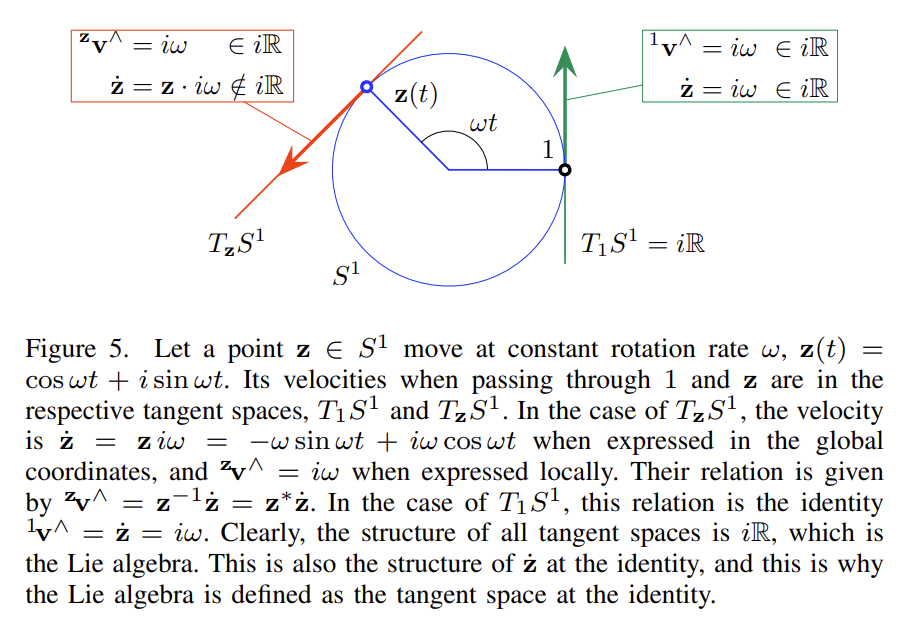

# Tangent Space - Complex Numbers

## Unit complex numbers using the group constraint

The unit complex numbers form the circle group:

$$
S^1 = \{z \in \mathbb{C} : z^*z = 1\}
$$

where $z^*$ is the complex conjugate. The constraint

$$
z^*z = 1
$$

means the complex number must always stay on the unit circle.

Now suppose $z(t)$ is a unit complex number moving over time. Its velocity is $\dot z(t)$. Since $z(t)$ must stay on the unit circle, its velocity cannot point in an arbitrary direction in $\mathbb{C}$. It must be tangent to the circle.

To find the tangent condition, differentiate the constraint:

$$
\frac{d}{dt}(z^*z) = 0
$$

Using the product rule:

$$
\dot z^*z + z^*\dot z = 0
$$

Now define

$$
a = z^*\dot z
$$

Then

$$
\dot z^*z = a^*
$$

so the differentiated constraint becomes

$$
a^* + a = 0
$$

This says that $a$ has zero real part. Therefore $a$ must be pure imaginary:

$$
z^*\dot z = i\omega,\quad \omega \in \mathbb{R}
$$

Since $z^{-1} = z^*$ for unit complex numbers, this is also

$$
z^{-1}\dot z = i\omega
$$

Multiplying both sides by $z$ gives the velocity at the point $z$:

$$
\dot z = zi\omega
$$

So $z^{-1}\dot z$ is the velocity pulled back from the tangent space at $z$ to the tangent space at the identity, while $\dot z = zi\omega$ is the tangent vector on the circle at $z$.

## Tangent space

At a point $z \in S^1$, the tangent space is

$$
T_zS^1 = \{zi\omega : \omega \in \mathbb{R}\}
$$

## Lie algebra

The Lie algebra is the special tangent space at the identity element $1$:

$$
\mathfrak{u}(1) = T_1S^1 = \{i\omega : \omega \in \mathbb{R}\}
$$

So the intuition is:

$$
\text{unit complex group} = \text{valid 2D rotations}
$$

$$
\text{Lie algebra} = \text{small 1D rotation angles}
$$

## Exp and Log

The exponential map takes a scalar angle $\omega$ and maps it to a unit complex number:

$$
\operatorname{Exp}(\omega) =
e^{i\omega} =
\cos\omega + i\sin\omega
$$

The logarithm map takes a unit complex number back to the Lie algebra:

$$
\operatorname{Log}(z) =
i\,\operatorname{atan2}(\operatorname{Im}(z), \operatorname{Re}(z))
$$

If

$$
z = x + iy
$$

then the scalar coordinate of the logarithm is

$$
\operatorname{Log}(z)^\vee = \operatorname{atan2}(y, x)
$$

The key idea is that the group constraint $z^*z = 1$ forces valid velocities to lie in a tangent space. When we pull a tangent vector back to the identity using $z^{-1}\dot z$, we get a pure imaginary number, which is an element of the Lie algebra.
